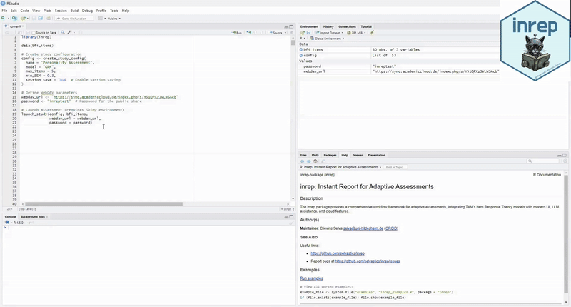
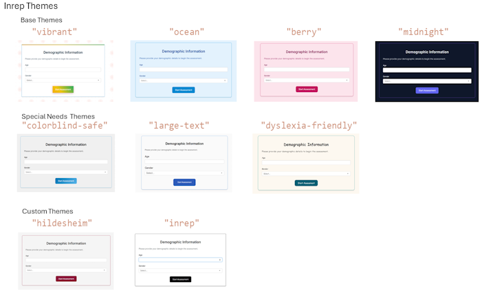

<!--- DISCLAIMER BANNER START --->
<div align="center" style="background: #f8f9fa; border: 2px solid #d6d8db; border-radius: 12px; padding: 25px; margin: 40px 0; max-width: 900px; box-shadow: 0 2px 10px rgba(0,0,0,0.1); font-family: Arial, sans-serif;">
  <h2 style="margin: 0 0 15px 0; color: #212529; font-weight: 800; text-transform: uppercase; letter-spacing: 1px;">
    Disclaimer
  </h2>
  <p style="margin: 0; font-size: 16px; line-height: 1.6; color: #343a40; text-align: left;">
    This project is a vibe coding experiment. I did the initial work alone, then expanded it using multiple LLMs. Much of the code is still rough, with some sections containing only minimal working examples as placeholders. Development and refinement are ongoing.
  </p>
</div>
<!--- DISCLAIMER BANNER END --->

<table width="100%"><tr>
<td><h1>inrep: Instant Reports for Adaptive Assessments</h1></td>

<td align="right" width="160">
  <a href="https://github.com/selvastics/inrep">
    
  </a>
</td>
</tr></table>

<!-- badges: start -->
<!-- [](https://github.com/selvastics/inrep/actions) -->
<!--[](https://lifecycle.r-lib.org/articles/stages.html#stable)
 [](https://doi.org/10.5281/zenodo.16682020) -->
<!-- badges: end -->

## Overview

**inrep Studio**  A starting point for building surveys without writing a single line of code. You can set up items, routing, scoring, and labels through an intuitive Shiny interface. This studio exports *inrep* code which runs directly in R.  
Try it out:  https://selvastics.shinyapps.io/inrep-studio/


**inrep** provides Shiny-based test administration, adaptive item selection, and reporting, with TAM integration for psychometric estimation. It supports adaptive and fixed questionnaires, session recovery, and export to common formats (CSV, JSON, SPSS, PDF). Themes and multilingual labels allow UI customization for different deployments.

<!-- Demo: See the package in action! -->



### Key features

- Adaptive and fixed testing; IRT models (1PL, 2PL, 3PL, GRM); stopping rules and item-selection criteria.
- Shiny-based administration; theme system; multilingual labels (EN, DE, ES, FR).
- TAM integration for IRT estimation in adaptive mode; reporting and validation tools; export to CSV/JSON/SPSS/PDF.
- Branching, randomization, piping, quotas, and participant management.
- Session recovery and logging; input validation and basic rate limiting; caching and parallel compute options; accessibility support.

## Installation

### Development Version

```r
# Install from GitHub (clean installation with dependency management)
devtools::install_github("selvastics/inrep", ref = "main", force = TRUE)

# Load the package
library(inrep)
```

<details>
<summary><strong style="color:#2a5db0">Set up instructions: Expand if R is not yet installed on your system</strong></summary>

<br>

### Step 1: Install R and RStudio

1. **Install R**: [https://cran.r-project.org](https://cran.r-project.org)  
2. **Install RStudio**: [https://posit.co/download/rstudio-desktop](https://posit.co/download/rstudio-desktop)

### Step 2: Install Required System Tools

- **Windows**: Install [Rtools](https://cran.r-project.org/bin/windows/Rtools/)  
- **macOS**: Open Terminal and run:

  ```bash
  xcode-select --install
  ```

### Step 3: Install the Required Packages

Open RStudio and copy-paste the following:

```r
# Install devtools (required to install from GitHub)
install.packages("devtools")

# Load the package
library(devtools)

# Install inrep from GitHub
devtools::install_github("selvastics/inrep")

# Load the installed package
library(inrep)
```

If you encounter any error during installation, make sure Rtools (on Windows) or Xcode (on macOS) was correctly installed and your R version is up to date.

</details>

### Dependencies

The package requires R ≥ 4.1.0 and integrates with the following packages:

* **shiny**
* **TAM**
* **ggplot2**

## Quick Start

### Adaptive Testing (IRT-based)

```r
library(inrep)
data(bfi_items)

# Adaptive assessment with item selection based on ability
config <- create_study_config(
  name = "Adaptive Personality Assessment",
  model = "GRM",           # Graded Response Model
  adaptive = TRUE,         # Enable adaptive testing (default)
  max_items = 15,
  min_items = 5,
  min_SEM = 0.3,          # Stop when precision reached
  demographics = c("Age", "Gender"),
  theme = "Professional"
)

# Launch the study
launch_study(config, bfi_items)
```

### Non-Adaptive Testing (Fixed questionnaire)

```r
# Traditional questionnaire with fixed item order
config_fixed <- create_study_config(
  name = "Personality Questionnaire",
  adaptive = FALSE,        # Disable adaptive testing
  max_items = 5,          # Show exactly 5 items in order
  theme = "hildesheim",   # University theme
  session_save = TRUE     # Enable recovery
)

# Launch the study
launch_study(config_fixed, bfi_items)
```

## Theme Customization 



> **Themes:** `inrep` supports multiple default UI themes for customizing assessment components.  
> In addition to built-in options, users can extract CSS styles from institutional websites  
> or define fully custom themes through direct CSS editing.  
>  
> New themes are added incrementally. Contributions are welcome to share themes that can be made available to other users.

## Main Functions

* **Study management:** `launch_study()`, `create_study_config()`
* **IRT analysis:** `estimate_ability()`, `select_next_item()`, `validate_item_bank()`
* **Extensions:**  `enable_llm_assistance()`

## Example Datasets

* `bfi_items`
* `math_items`
* `cognitive_items`

## Configuration

* Stopping Rules
* Item Selection Criteria
* Themes and Languages
* Session Management

## Contributing

See `CONTRIBUTING.md` on GitHub.

## License

Custom License (Non-Commercial, Attribution, Permission Required)

## Support

**Author:** Clievins Selva
**Affiliation:** University of Hildesheim
**Contact:** [selva@uni-hildesheim.de](mailto:selva@uni-hildesheim.de)