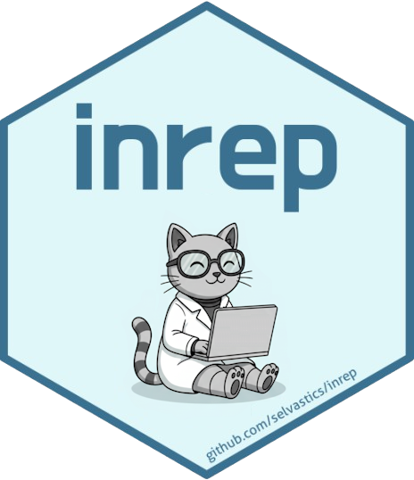
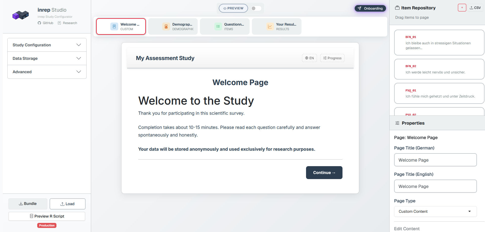
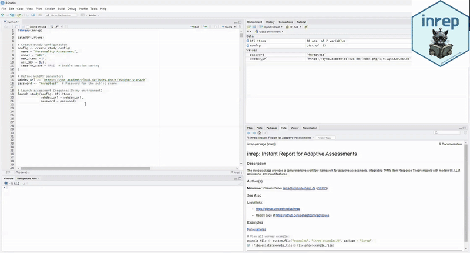

<table width="100%"><tr>
<td><h1>inrep: Instant Reports for Adaptive Assessments</h1></td>

<td align="right" width="160">
  <a href="https://github.com/selvastics/inrep">
    
  </a>
</td>
</tr></table>

<!-- badges: start -->
<!-- [](https://github.com/selvastics/inrep/actions) -->
<!--[](https://lifecycle.r-lib.org/articles/stages.html#stable)
 [](https://doi.org/10.5281/zenodo.16682020) -->
<!-- badges: end -->

## Overview

**inrep Studio** is a Shiny app for configuring surveys/assessments using a UI. It can generate *inrep* R code that you can run directly in R.
Try it out: [inrep-studio](https://selvastics.shinyapps.io/inrep-studio/)



**inrep** (instant reports) runs questionnaires and tests as Shiny apps in R and gives each participant a report at the end of the session. Because the study runs in R, the report can use the same scoring as the later analysis, for example a person estimate from a calibrated IRT model.

inrep does not calibrate items. Researchers calibrate with the software they prefer, for example TAM or mirt; the vignettes show it with TAM (Robitzsch, Kiefer & Wu). With a calibration, a study can give each participant only part of the items, in booklets or adaptively, and still report everyone on the same scale.

<!-- Demo: See the package in action! -->



### Key features

- Fixed, booklet and adaptive designs. In adaptive mode inrep selects items by Fisher information and estimates ability by EAP, with the item parameters (1PL, 2PL, 3PL or GRM) held fixed.
- Page flows (`custom_page_flow`) with custom HTML pages, demographics, item pages and results pages; `item_indices` can be a function, for example to draw a booklet per participant.
- Interface labels in English, German, Spanish and French; item and page text can be given in a second language with `_en` fields.
- Themes, including high-contrast, large-text and dyslexia-friendly variants. These are style sheets, not a tested accessibility standard.
- Results pages filled by your own `results_processor` function; export as RDS, CSV or JSON, a PDF report, and optional upload to a WebDAV server.

## Installation

### Development Version

```r
# Install from GitHub
devtools::install_github("selvastics/inrep", ref = "main", force = TRUE)

# Load the package
library(inrep)
```

<details>
<summary><strong style="color:#2a5db0">Set up instructions: Expand if R is not yet installed on your system</strong></summary>

<br>

### Step 1: Install R and RStudio

1. **Install R**: [https://cran.r-project.org](https://cran.r-project.org)  
2. **Install RStudio**: [https://posit.co/download/rstudio-desktop/](https://posit.co/download/rstudio-desktop/)

### Step 2: Install Required System Tools

- **Windows**: Install [Rtools](https://cran.r-project.org/bin/windows/Rtools/)  
- **macOS**: Open Terminal and run:

  ```bash
  xcode-select --install
  ```

### Step 3: Install the Required Packages

Open RStudio and copy-paste the following:

```r
# Install devtools (required to install from GitHub)
install.packages("devtools")

# Load the package
library(devtools)

# Install inrep from GitHub
devtools::install_github("selvastics/inrep")

# Load the installed package
library(inrep)
```

If you encounter any error during installation, make sure Rtools (on Windows) or Xcode (on macOS) was correctly installed and your R version is up to date.

</details>

### Dependencies

The package requires R >= 4.1.0 and imports **shiny**, **later** and **jsonlite**. Packages such as **ggplot2** (plots in reports), **TAM** or **mirt** (calibration, done outside inrep) and **pagedown** (PDF reports) are suggested and only needed for the corresponding features.

## Quick Start

### Non-Adaptive Testing (Fixed questionnaire)

```r
library(inrep)
data(bfi_items)

# Traditional questionnaire with fixed item order
config_fixed <- create_study_config(
  name = "Personality Questionnaire",
  adaptive = FALSE,        # Disable adaptive testing
  max_items = 5,          # Show the first 5 items in order
  theme = "hildesheim"
)

# Launch the study
launch_study(config_fixed, bfi_items)
```

### Adaptive Testing (IRT-based)

The parameters in `bfi_items` are simulated and all 30 items are treated as one dimension, so this example only shows the mechanics. A real adaptive test needs a calibrated, unidimensional item bank.

```r
library(inrep)
data(bfi_items)

# Adaptive administration with simulated GRM parameters
config <- create_study_config(
  name = "Adaptive Personality Assessment",
  model = "GRM",           # Graded Response Model
  adaptive = TRUE,         # Enable adaptive testing (default)
  max_items = 15,
  min_items = 5,
  min_SEM = 0.3,          # Stop when precision reached
  demographics = c("Age", "Gender"),
  theme = "Professional"
)

# Launch the study
launch_study(config, bfi_items)
```

## Main Functions

* **Study management:** `launch_study()`, `create_study_config()`
* **Data:** `launch_study(save_data = TRUE)` writes one CSV file per participant; `read_study_data()` reads them into one data frame
* **Scoring and item selection (fixed item parameters):** `estimate_ability()`, `select_next_item()`, `validate_item_bank()`

## Example Datasets

* `bfi_items`: 30 Big Five style items with simulated GRM parameters
* `math_items`: 40 placeholder items (no real item text) with simulated GRM parameters
* `cognitive_items`: 50 items with simulated 2PL values (different column names; not directly usable in `launch_study()`)

## Configuration

* Themes (case-insensitive): `Light`, `Professional`, `Midnight`, `Ocean`, `Forest`, `Berry`, `Sunset`, `Sepia`, `Paper`, `Monochrome`, `Vibrant`, `Darkblue`, `Dark-Mode`, `hildesheim`, `inrep`, and the variants `High-Contrast`, `Large-Text`, `Dyslexia-Friendly`, `Colorblind-Safe`, `Accessible-Blue`. `get_available_themes()` lists all theme files.
* Interface languages (`language` in `create_study_config()`): `en`, `de`, `es`, `fr`

## Support

**Author:** Clievins Selva
**Affiliation:** University of Hildesheim
**Contact:** [selva@uni-hildesheim.de](mailto:selva@uni-hildesheim.de)