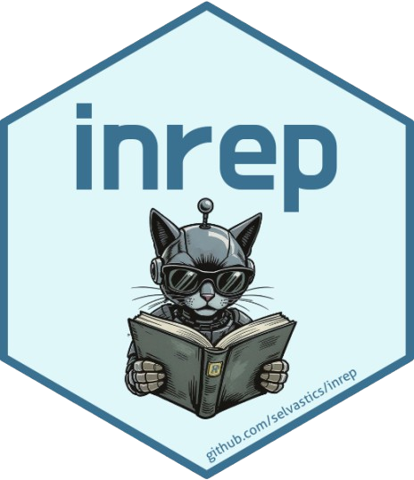

<p align="right">
  <a href="https://github.com/selvastics/inrep">
    
  </a>
</p>

# inrep: Instant Reports for Adaptive Assessments
<!-- Demo: See the package in action! -->


> **Demo:** The above video showcases the main functionalities of the inrep package, including adaptive test setup, Shiny-based administration, theme customization, LLM-powered assistance, and professional reporting. Watch to see how easy it is to configure, deploy, and analyze adaptive assessments with inrep.


<!-- badges: start -->
[](https://CRAN.R-project.org/package=inrep)
[](https://github.com/selvastics/inrep/actions)
[](https://lifecycle.r-lib.org/articles/stages.html#stable)
[](https://cran.r-project.org/package=inrep)
<!-- badges: end -->

## Overview

**inrep** provides a comprehensive framework for adaptive testing using Item Response Theory (IRT) models. The package offers web-based interfaces for test administration via Shiny, supports multiple IRT models through TAM integration, implements adaptive item selection algorithms, and includes comprehensive reporting capabilities with LLM integration for enhanced user assistance. It is designed for psychological assessments, educational testing, and survey research with large item pools.

### Key Features

- **Adaptive Testing**: Support for multiple IRT models (1PL, 2PL, 3PL, GRM) with sophisticated item selection algorithms  
- **Web-based Interface**: Modern Shiny applications for test administration and data collection  
- **TAM Integration**: All psychometric computations performed using the validated TAM package  
- **LLM Integration**: Built-in support for LLM assistance in study configuration, deployment guidance, and optimization  
- **Website Theme Scraping**: Extract colors, fonts, and logos from institutional websites for automatic branding  
- **Multilingual Support**: Interface available in English, German, Spanish, and French  
- **Customizable Themes**: Professional appearance with accessibility compliance  
- **Comprehensive Reporting**: Multiple export formats with detailed analytics and visualizations  
- **Session Management**: Robust session handling with resume capabilities  

## Installation

### Development Version

```r
# Install from GitHub
devtools::install_github("selvastics/inrep")
````

> 📌 [Click here if you have never installed anything in R before](#installation-instructions-for-beginners)

### Dependencies

The package requires R ≥ 4.1.0 and integrates with the following packages:

* **shiny**
* **TAM**
* **DT**
* **ggplot2**

## Quick Start

### Basic Usage

```r
library(inrep)

data(bfi_items)

config <- create_study_config(
  name = "Personality Assessment",
  model = "GRM",
  max_items = 15,
  min_items = 5,
  min_SEM = 0.3,
  demographics = c("Age", "Gender"),
  language = "en"
)

launch_study(config, bfi_items)
```

### Advanced Cognitive Assessment

```r
data(cognitive_items)

advanced_config <- create_study_config(
    name = "Cognitive Ability Assessment",
    model = "2PL", 
    estimation_method = "TAM",
    max_items = 20,
    min_items = 10,
    min_SEM = 0.25,
    criteria = "MI",
    theta_prior = c(0, 1),
    demographics = c("Age", "Gender", "Education", "Native_Language"),
    input_types = list(
        Age = "numeric",
        Gender = "select", 
        Education = "select",
        Native_Language = "text"
    ),
    theme = "Professional",
    session_save = TRUE,
    parallel_computation = TRUE,
    cache_enabled = TRUE,
    accessibility_enhanced = TRUE
)

launch_study(
    config = advanced_config,
    item_bank = cognitive_items,
    accessibility = TRUE,
    admin_dashboard_hook = function(session_data) {
        cat("Participant ID:", session_data$participant_id, "\n")
        cat("Progress:", session_data$progress, "%\n")
        cat("Current theta:", round(session_data$theta, 3), "\n")
        cat("Standard error:", round(session_data$se, 3), "\n")
    }
)
```


---

## Installation Instructions for Beginners

If you are new to R and have never installed a package before, follow these steps:

### Step 1: Install R and RStudio

1. **Install R**: [https://cran.r-project.org](https://cran.r-project.org)
2. **Install RStudio**: [https://posit.co/download/rstudio-desktop](https://posit.co/download/rstudio-desktop)

### Step 2: Install Required System Tools

* **Windows**: Install [Rtools](https://cran.r-project.org/bin/windows/Rtools/)
* **macOS**: Open Terminal and run:

  ```bash
  xcode-select --install
  ```

### Step 3: Install the Required Packages

Open RStudio and copy-paste the following:

```r
# Install devtools (required to install from GitHub)
install.packages("devtools")

# Load the package
library(devtools)

# Install inrep from GitHub
devtools::install_github("selvastics/inrep")

# Load the installed package
library(inrep)
```

If you encounter any error during installation, make sure Rtools (on Windows) or Xcode (on macOS) was correctly installed and your R version is up to date.

---

## Documentation

* `vignette("getting-started", package = "inrep")`
* `vignette("customizing-appearance", package = "inrep")`
* `vignette("research-workflows", package = "inrep")`

## Main Functions

* `launch_study()`
* `create_study_config()`
* `estimate_ability()`
* `select_next_item()`
* `validate_item_bank()`
* `scrape_website_ui()`
* `enable_llm_assistance()`

## Example Datasets

* `bfi_items`
* `math_items`

## Configuration Options

* IRT Models: 1PL, 2PL, 3PL, GRM
* Stopping Rules
* Item Selection Criteria
* Themes and Languages
* Session Management
* LLM Integration

## Citation

```
Selva, C. (2025). inrep: Instant Reports for Adaptive Assessments.  
R package version 1.0.0. https://github.com/selvastics/inrep
```

## Contributing

See `CONTRIBUTING.md` and `CODE_OF_CONDUCT.md` on GitHub.

## License

MIT License

## Support

* GitHub: [https://github.com/selvastics/inrep/issues](https://github.com/selvastics/inrep/issues)
* Email: [selva@uni-hildesheim.de](mailto:selva@uni-hildesheim.de)

## Acknowledgments

I thank Alla Sawatzky and Kathrin Schütz for their early endorsement of this project and their insightful guidance during its initial stages.

---

**Author:** Clievins Selva
**Affiliation:** University of Hildesheim
**Contact:** [selva@uni-hildesheim.de](mailto:selva@uni-hildesheim.de)

