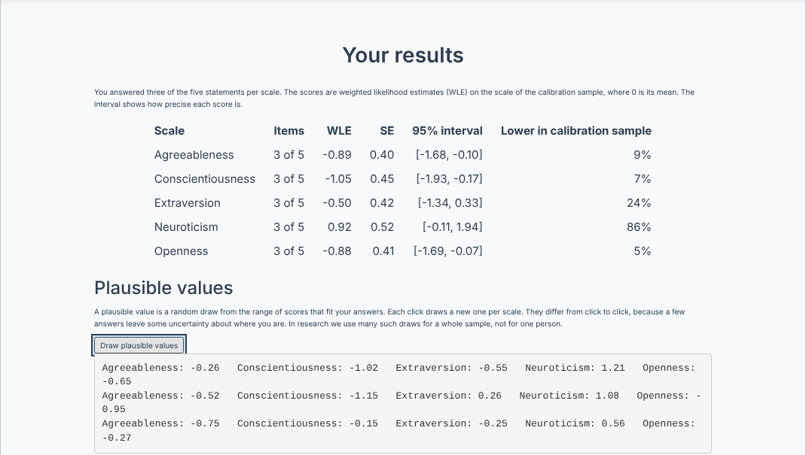

```{r setup, include = FALSE}
has_tam <- requireNamespace("TAM", quietly = TRUE) &&
  requireNamespace("psych", quietly = TRUE)
knitr::opts_chunk$set(collapse = TRUE, comment = "#>", eval = has_tam)
```

# What this vignette is about

Most studies give every participant every item. This is the simplest design, and when a questionnaire is short it is usually the right one. It becomes costly when a study needs many constructs and participants have only a limited amount of time. A planned missingness design gives each participant only part of the items, on purpose and at random, and recovers what is needed for the analysis from the whole sample.

Such a design only works if we know how the items relate to the construct they measure. This is where a measurement model comes in. In this vignette we calibrate the five scales of the `psych::bfi` data with the TAM package, use the calibration to plan a booklet design in which every participant answers three of the five items per scale, and run that design in inrep. Participants receive a score for each scale at the end, and we show what the researcher does with the incomplete data afterwards.

The vignette builds on Vignette 1 (item banks and page flow) and Vignette 2 (the `results_processor`). The code chunks run only when TAM and psych are installed.

------------------------------------------------------------------------

# What inrep computes and what it does not

inrep presents items, records the responses, and carries out the study logic: the page flow, the checks for missing answers and the storage of the data. It does not estimate item parameters, it does not test whether a model fits, and it does not draw plausible values. All of this is done in a package for psychometric modelling. Here we use TAM (Robitzsch et al., 2024), and the results are passed to inrep.

There is one place where inrep does compute something itself. In an adaptive study (Vignette 3) inrep updates an ability estimate after every response and uses it to choose the next item. For this it takes the item parameters in the item bank as fixed and known, and evaluates the likelihood on a grid (an EAP estimate with a normal prior). This applies a calibration that was done elsewhere; it does not estimate one. If the parameters in the item bank are wrong, inrep has no way to notice.

In the design below inrep computes nothing of this kind. The items are presented in booklets, and the score each participant sees is computed by TAM inside the `results_processor`.

------------------------------------------------------------------------

# Part 1: The aim

A measurement model such as the partial credit model (PCM; Masters, 1982) makes strong assumptions. All items of a scale measure the same latent variable, and they differ only in where along that variable their response categories lie. In the PCM the items also have the same discrimination. These constraints are often seen as a burden, because real items rarely meet them exactly.

The same constraints are what makes a planned missingness design possible. If the model holds and the item parameters are known from a calibration, every subset of items places a person on the same scale. A participant who answered items 1, 2 and 3 can then be compared with one who answered items 3, 4 and 5, without either having answered all five. The missing responses are missing because of the design, at random, so they carry no information about the person and can be ignored in the estimation. Large-scale assessments such as PISA rely on this idea and use rotated booklets in which no student works on all tasks.

What the design gives up is precision at the level of the individual. Three items say less about a person than five. At the level of the population, however, the means, variances and correlations of the latent variables can still be estimated without bias from the incomplete data, because the model connects the booklets. Selva and Heine (2026) compared plausible values, multiple imputation and full information maximum likelihood for data of this kind in the PISA 2022 Creative Thinking assessment, where parts of the assessment are missing by design. In their analyses plausible values suited comparisons between groups of the population, multiple imputation suited situations in which auxiliary variables could justifiably be varied, and full information maximum likelihood suited confirmatory models. Where the methods led to comparable results, they recommended the simpler one, because it is easier to follow.

Two consequences for this vignette follow from this aim.

- The score we report to a participant is a point estimate for that person. We use the weighted likelihood estimate (WLE; Warm, 1989), which has little bias even when only a few items were answered.
- Questions about the population, for example how strongly Extraversion and Agreeableness are related, are answered from the latent model or from plausible values, not from the WLE scores (Part 7).

------------------------------------------------------------------------

# Part 2: The data

The `bfi` data in the psych package contain 25 items from the International Personality Item Pool, five per Big Five domain, answered by 2,800 participants of the SAPA project on a six-point scale from "Very Inaccurate" to "Very Accurate".

```{r data}
suppressPackageStartupMessages(library(TAM))
data(bfi, package = "psych")

items <- bfi[, 1:25]

# Negatively keyed items are reversed, so that a higher response always
# means more of the trait. Neuroticism has no reversed items.
reversed <- c("A1", "C4", "C5", "E1", "E2", "O2", "O5")
items[reversed] <- 7 - items[reversed]

# TAM expects the lowest category to be 0
items <- items - 1

scales <- split(names(items), substr(names(items), 1, 1))
scales
```

We keep participants with missing responses. TAM uses all responses that are present, so there is no need to delete cases listwise.

------------------------------------------------------------------------

# Part 3: Calibrating five unidimensional models

## 3.1 One model per scale

We treat each domain as its own unidimensional scale and fit a separate PCM to each. A multidimensional model would also be possible (Part 7 uses one), but separate models are easier to check, and they match the way the scales are reported.

```{r calibrate}
grid <- seq(-6, 6, by = 0.2)   # a fine grid, used again in Part 4

pcm <- lapply(scales, function(v)
  tam.mml(items[v], irtmodel = "PCM",
          control = list(progress = FALSE, nodes = grid)))
```

TAM fixes the mean of the latent variable at 0 in the calibration sample and estimates its variance. The scale of each domain is therefore in logits, centred at the sample mean.

```{r variances}
round(sapply(pcm, function(m) c(mean = m$beta[1], variance = m$variance[1])), 2)
```

## 3.2 Item parameters

The PCM has one parameter per category step (`xsi`). The Thurstonian thresholds are often easier to read: the point on the latent scale at which a person has a 50 % chance to respond in that category or higher.

```{r thresholds}
round(tam.threshold(pcm$E), 2)
```

The columns `Cat1` to `Cat5` belong to the five transitions between the six categories. In the Extraversion scale, for example, a person at the sample mean (0) is likely to respond at least "Slightly Accurate" (category 3, column `Cat3`) to all five items, but not "Moderately Accurate" (`Cat4`) to items E1 to E3.

## 3.3 Item fit

The infit and outfit mean squares compare the observed responses with those the model expects. Values close to 1 mean the item behaves as the model says.

```{r fit}
fit <- lapply(pcm, function(m) msq.itemfit(m)$itemfit[, c("item", "Infit", "Outfit")])
fit_table <- do.call(rbind, fit)
fit_table$Infit  <- round(fit_table$Infit, 2)
fit_table$Outfit <- round(fit_table$Outfit, 2)
fit_table[order(-abs(fit_table$Infit - 1)), ][1:6, ]
```

All infit values lie between 0.89 and 1.23, which is within the range usually considered acceptable for rating scales. The six items with the largest deviation are shown above.

## 3.4 Is the constraint justified?

The PCM gives all items of a scale the same discrimination. The generalized partial credit model (GPCM) relaxes this, and we can compare both.

```{r gpcm}
gpcm <- lapply(scales, function(v)
  tam.mml.2pl(items[v], irtmodel = "GPCM",
              control = list(progress = FALSE, nodes = grid)))

round(sapply(names(scales), function(s) c(
  BIC_PCM  = pcm[[s]]$ic$BIC,
  BIC_GPCM = gpcm[[s]]$ic$BIC)))
```

The GPCM has the lower BIC on every scale. With 2,800 participants even small differences in discrimination become visible, and the strong constraint does not describe these data best. We keep the PCM nevertheless, because the aim here is a design in which three items of any combination give comparable scores, and in which the parameters are simple to communicate. Under the PCM the sum score of the answered items is a sufficient statistic for the person. This is a choice, and it should be reported as such. If the aim requires item-specific discriminations, the GPCM objects can be used in all of the following steps without changes.

## 3.5 Saving the calibration

The study only needs the five model objects.

```{r save, eval = FALSE}
saveRDS(pcm, "bfi_pcm.rds")
```

The file is several MB large, since TAM keeps the calibration data in the objects. That is no problem for a study on a server.

------------------------------------------------------------------------

# Part 4: Scoring a new participant with fixed parameters

A participant in the study is not part of the calibration sample. The item parameters therefore stay as they were estimated, and only the person is scored. Three small functions do this. The first two only call TAM or use what TAM stored; the third draws from the posterior that TAM's model implies.

```{r helpers}
# WLE and its standard error
wle_fixed <- function(mod, resp) {
  resp <- matrix(as.numeric(resp), nrow = 1)
  # tam.wle() needs at least two rows, so the pattern is passed twice
  w <- TAM::tam.wle(mod, score.resp = rbind(resp, resp), progress = FALSE)
  c(theta = w$theta[1], se = w$error[1])
}

# Posterior of theta on the grid of the calibration, with the distribution
# of the calibration sample as prior
posterior_fixed <- function(mod, resp) {
  probs <- mod$rprobs                     # items x categories x grid
  theta <- mod$theta[, 1]
  post  <- dnorm(theta, mod$beta[1], sqrt(mod$variance[1]))
  for (i in which(!is.na(resp))) post <- post * probs[i, resp[i] + 1, ]
  list(theta = theta, p = post / sum(post))
}

# Plausible values: random draws from that posterior. The uniform jitter
# spreads each draw over the width of its grid interval.
pv_fixed <- function(mod, resp, n = 5) {
  post <- posterior_fixed(mod, resp)
  h <- diff(post$theta[1:2])
  sample(post$theta, n, replace = TRUE, prob = post$p) + runif(n, -h / 2, h / 2)
}
```

Before we use the functions, we check them against TAM for the first participant of the calibration sample. The WLE must equal the one `tam.wle()` gives for the whole sample, and the mean of the posterior must equal TAM's EAP.

```{r check_helpers}
r1   <- as.numeric(items[1, scales$E])
post <- posterior_fixed(pcm$E, r1)

c(WLE_helper = wle_fixed(pcm$E, r1)[["theta"]],
  WLE_TAM    = tam.wle(pcm$E, progress = FALSE)$theta[1],
  EAP_helper = sum(post$theta * post$p),
  EAP_TAM    = pcm$E$person$EAP[1])
```

With two items not administered the WLE becomes less precise, which shows in a larger standard error:

```{r missing_items}
r1_booklet <- r1
r1_booklet[c(2, 4)] <- NA
rbind(all_items = wle_fixed(pcm$E, r1), booklet = wle_fixed(pcm$E, r1_booklet))
set.seed(1)
round(pv_fixed(pcm$E, r1_booklet, n = 5), 2)
```

The five plausible values scatter around the WLE. Each one is a possible value of the person's trait given the responses; none of them is the person's score.

------------------------------------------------------------------------

# Part 5: A booklet design

## 5.1 Five booklets per scale

Each participant answers three of the five items of every scale. We use five booklets per scale:

```{r booklets}
booklets <- list(c(1, 2, 3), c(3, 4, 5), c(1, 4, 5), c(2, 3, 5), c(1, 2, 4))

# how often each pair of items appears together
pairs <- combn(5, 2)
table(apply(pairs, 2, function(p)
  sum(sapply(booklets, function(b) all(p %in% b)))))
```

Every item is part of three booklets, and every pair of items appears together in at least one booklet. This matters, because a pair that is never presented together leaves its covariance without data. In the study a booklet is drawn at random for each participant and scale, so participants can answer different booklets on different scales.

## 5.2 What we lose and what we keep

Before running the design, we can simulate it on the calibration data. We delete the responses that a booklet would not have presented and compare the WLE from three items with the WLE from all five.

```{r simulate}
set.seed(2026)
pm_items <- items
for (s in names(scales)) {
  b <- sample(length(booklets), nrow(items), replace = TRUE)
  m <- as.matrix(items[scales[[s]]])
  for (i in seq_len(nrow(m))) m[i, -booklets[[b[i]]]] <- NA
  pm_items[scales[[s]]] <- m
}

comparison <- sapply(names(scales), function(s) {
  full <- tam.wle(pcm[[s]], progress = FALSE)
  part <- tam.wle(pcm[[s]], score.resp = as.matrix(pm_items[scales[[s]]]),
                  progress = FALSE)
  ok <- is.finite(full$theta) & is.finite(part$theta)
  c(correlation      = cor(full$theta[ok], part$theta[ok]),
    mean_difference  = mean(part$theta[ok] - full$theta[ok]),
    reliability_full = WLErel(full$theta[ok], full$error[ok]),
    reliability_part = WLErel(part$theta[ok], part$error[ok]))
})
round(comparison, 2)
```

The WLE from three items correlates around .9 with the WLE from all five, and the mean difference is close to zero, so the booklets do not shift the scale. The WLE reliability drops, from between .57 and .76 with five items to between .36 and .63 with three. For an individual report this is the cost of the design, and the report should show it (Part 6 prints the standard error with every score).

------------------------------------------------------------------------

# Part 6: Running the design in inrep

## 6.1 Booklets as item pages

For each scale the page flow has one item page. Instead of a fixed vector, its `item_indices` is a function. inrep calls the function when the page is shown for the first time, keeps the result for the rest of the session, and uses it to check and store the responses. The function receives the reactive values of the session, the item bank and the configuration.

```{r draw_booklet, eval = FALSE}
draw_booklet <- function(s) {
  function(rv, item_bank, config) {
    which(item_bank$scale == s)[booklets[[sample(length(booklets), 1)]]]
  }
}
```

Items that a participant did not see are stored as `NA`. In the data set they can be told apart from skipped items by the booklet design, since the items on a page are required.

## 6.2 The report

The `results_processor` scores every scale with `wle_fixed()` and shows the WLE with its standard error and a 95 % interval. As a reference point it adds the share of the calibration sample with a lower value, from the normal distribution that TAM estimated for that sample.

Plausible values carry little meaning for one person: they are random draws, and they change every time. For teaching, however, it can be useful to let participants see this. With `show_pv_button <- TRUE` the report contains a button that draws one plausible value per scale from the participant's posterior, in the browser. Each click adds a new line, so participants see how the values scatter around their WLE and how wide the scatter is with three items.

```{r booklet_report, echo = FALSE, eval = TRUE, out.width = "100%", fig.cap = "The report of one participant, after three clicks on the button."}

```

## 6.3 The complete script

The script expects `bfi_pcm.rds` from Part 3.5 and the three functions from Part 4 in a file `pm_helpers.R` next to it.

```{r app, eval = FALSE}
# Big Five study with a planned missingness design ----
#
# Every participant answers three of the five items of each bfi scale. Which
# three is drawn per participant and scale from five booklets. The report
# shows a WLE per scale, computed by TAM from the calibration in Part 3.
library(inrep)
source("pm_helpers.R")          # wle_fixed(), posterior_fixed(), pv_fixed()
pcm <- readRDS("bfi_pcm.rds")   # five PCMs from Part 3, one per scale

# Item bank ----
item_text <- c(
  A1 = "Am indifferent to the feelings of others.",
  A2 = "Inquire about others' well-being.",
  A3 = "Know how to comfort others.",
  A4 = "Love children.",
  A5 = "Make people feel at ease.",
  C1 = "Am exacting in my work.",
  C2 = "Continue until everything is perfect.",
  C3 = "Do things according to a plan.",
  C4 = "Do things in a half-way manner.",
  C5 = "Waste my time.",
  E1 = "Don't talk a lot.",
  E2 = "Find it difficult to approach others.",
  E3 = "Know how to captivate people.",
  E4 = "Make friends easily.",
  E5 = "Take charge.",
  N1 = "Get angry easily.",
  N2 = "Get irritated easily.",
  N3 = "Have frequent mood swings.",
  N4 = "Often feel blue.",
  N5 = "Panic easily.",
  O1 = "Am full of ideas.",
  O2 = "Avoid difficult reading material.",
  O3 = "Carry the conversation to a higher level.",
  O4 = "Spend time reflecting on things.",
  O5 = "Will not probe deeply into a subject."
)
item_bank <- data.frame(
  id                 = names(item_text),
  Question           = unname(item_text),
  ResponseCategories = "1,2,3,4,5,6",
  scale              = substr(names(item_text), 1, 1),
  reversed           = names(item_text) %in% c("A1", "C4", "C5", "E1", "E2", "O2", "O5"),
  stringsAsFactors   = FALSE
)
scale_names <- c(A = "Agreeableness", C = "Conscientiousness", E = "Extraversion",
                 N = "Neuroticism", O = "Openness")

# Booklets ----
# Each booklet holds three of the five items of a scale. Every item is in three
# booklets, and every pair of items appears together in at least one.
booklets <- list(c(1, 2, 3), c(3, 4, 5), c(1, 4, 5), c(2, 3, 5), c(1, 2, 4))

# inrep calls this function when the page is shown and keeps the result for
# the rest of the session
draw_booklet <- function(s) {
  function(rv, item_bank, config) {
    which(item_bank$scale == s)[booklets[[sample(length(booklets), 1)]]]
  }
}

# Report ----
show_pv_button <- TRUE   # lets participants draw plausible values (Part 6.2)

pm_report <- function(responses, item_bank) {
  tryCatch({
    resp <- as.numeric(responses)[seq_len(nrow(item_bank))]
    resp[item_bank$reversed] <- 7 - resp[item_bank$reversed]
    resp <- resp - 1                     # TAM expects categories 0 to 5

    rows <- character(0); pv_data <- character(0)
    for (s in names(scale_names)) {
      r   <- resp[item_bank$scale == s]
      mod <- pcm[[s]]
      est <- wle_fixed(mod, r)
      sd_pop <- sqrt(mod$variance[1])
      below  <- round(100 * pnorm(est[["theta"]], mod$beta[1], sd_pop))
      rows <- c(rows, sprintf(
        "<tr><td>%s</td><td>%d of 5</td><td>%.2f</td><td>%.2f</td><td>[%.2f, %.2f]</td><td>%d%%</td></tr>",
        scale_names[[s]], sum(!is.na(r)), est[["theta"]], est[["se"]],
        est[["theta"]] - 1.96 * est[["se"]], est[["theta"]] + 1.96 * est[["se"]], below))
      # the posterior goes to the browser, where the button draws from it
      post <- posterior_fixed(mod, r)
      pv_data <- c(pv_data, sprintf("'%s':{t:[%s],p:[%s]}", scale_names[[s]],
        paste(round(post$theta, 3), collapse = ","),
        paste(signif(post$p, 4), collapse = ",")))
    }

    table_html <- paste0(
      "<style>.pm-table td, .pm-table th {padding:4px 12px; text-align:right;}",
      ".pm-table td:first-child, .pm-table th:first-child {text-align:left;}</style>",
      "<table class='pm-table' style='border-collapse:collapse;margin:12px auto;font-size:15px;'>",
      "<tr><th>Scale</th><th>Items</th><th>WLE</th>",
      "<th>SE</th><th>95% interval</th><th>Lower in calibration sample</th></tr>",
      paste(rows, collapse = ""), "</table>")

    pv_html <- if (show_pv_button) paste0(
      "<h3>Plausible values</h3>",
      "<p>A plausible value is a random draw from the range of scores that fit ",
      "your answers. Each click draws a new one per scale. They differ from click ",
      "to click, because a few answers leave some uncertainty about where you are. ",
      "In research we use many such draws for a whole sample, not for one person.</p>",
      "<button type='button' onclick='inrepDrawPV()'>Draw plausible values</button>",
      "<pre id='pv_out' style='text-align:left;white-space:pre-wrap;'></pre>",
      "<script>var inrepPost={", paste(pv_data, collapse = ","), "};",
      "function inrepDrawPV(){var out=[];for(var k in inrepPost){var d=inrepPost[k],",
      "u=Math.random(),c=0,i=0;for(;i<d.p.length-1;i++){c+=d.p[i];if(c>=u)break;}",
      "var h=d.t[1]-d.t[0];out.push(k+': '+(d.t[i]+(Math.random()-0.5)*h).toFixed(2));}",
      "document.getElementById('pv_out').textContent+=out.join('   ')+'\\n';}</script>"
    ) else ""

    shiny::HTML(paste0(
      "<div style='max-width:820px;margin:0 auto;font-family:system-ui,sans-serif;'>",
      "<p>You answered three of the five statements per scale. The scores are ",
      "weighted likelihood estimates (WLE) on the scale of the calibration sample, ",
      "where 0 is its mean. The interval shows how precise each score is.</p>",
      table_html, pv_html, "</div>"))
  }, error = function(e) {
    shiny::HTML(paste("<p>The report could not be created:", e$message, "</p>"))
  })
}

# Page flow ----
item_page <- function(s) list(
  id = paste0("scale_", s), type = "items",
  title = scale_names[[s]], title_en = scale_names[[s]],
  item_indices = draw_booklet(s), scale_type = "likert",
  instructions    = "How accurately does each statement describe you?",
  instructions_en = "How accurately does each statement describe you?")

custom_page_flow <- c(
  list(list(id = "intro", type = "custom", title = "Welcome", title_en = "Welcome",
            content    = "<h2>Welcome</h2><p>15 short statements about yourself.</p>",
            content_en = "<h2>Welcome</h2><p>15 short statements about yourself.</p>")),
  lapply(names(scale_names), item_page),
  list(list(id = "results", type = "results",
            title = "Your results", title_en = "Your results"))
)

# Study configuration ----
study_config <- create_study_config(
  name              = "Big Five, planned missingness",
  custom_page_flow  = custom_page_flow,
  model             = "GRM",
  adaptive          = FALSE,
  language          = "en",
  bilingual         = FALSE,
  response_ui_type  = "radio",
  results_processor = pm_report
)

launch_study(study_config, item_bank)
```

Two details are easy to overlook. The responses arrive in the order of the item bank, with the values 1 to 6 of `ResponseCategories`, so they must be reversed and shifted in the same way as in the calibration. And the item pages use inrep's English agreement labels, while the SAPA participants answered on an accuracy scale. A change in the response labels can shift the thresholds. For a real study the labels should be the same as in the calibration, or the items should be recalibrated.

------------------------------------------------------------------------

# Part 7: Analysing the data afterwards

The WLE serves the participant. For the analysis, the researcher works with the stored responses, which contain the `NA`s of the design. TAM estimates the model from these incomplete data directly. As an example we fit a two-dimensional model for Extraversion and Agreeableness to the simulated booklet data from Part 5.2, and compare it with the same model on the complete data.

```{r latent_correlation}
ea <- c(scales$E, scales$A)
Q  <- cbind(E = rep(1:0, each = 5), A = rep(0:1, each = 5))
nodes_2d <- seq(-5, 5, length.out = 21)

fit_full <- tam.mml(items[ea],    Q = Q, irtmodel = "PCM",
                    control = list(progress = FALSE, nodes = nodes_2d))
fit_pm   <- tam.mml(pm_items[ea], Q = Q, irtmodel = "PCM",
                    control = list(progress = FALSE, nodes = nodes_2d))

wle_pm <- sapply(c("E", "A"), function(s)
  tam.wle(pcm[[s]], score.resp = as.matrix(pm_items[scales[[s]]]),
          progress = FALSE)$theta)

c(latent_full    = cov2cor(fit_full$variance)[1, 2],
  latent_booklet = cov2cor(fit_pm$variance)[1, 2],
  WLE_booklet    = cor(wle_pm, use = "pairwise")[1, 2])
```

The latent correlation estimated from the booklet data is close to the one from the complete data, although about 40 % of the item responses are missing. The correlation of the WLE scores is clearly lower, because each WLE contains measurement error that the latent model separates from the trait. This is why population questions are not answered with the WLE.

If further analyses need person-level values, for example a regression in another program, plausible values can be drawn from the same model. Background variables that the analysis will use belong in the model as well (argument `Y` of `tam.mml()`), otherwise their relations to the latent variables are underestimated.

```{r plausible_values}
# Draws from a normal approximation of each posterior. On a coarse 2D grid,
# draws from the grid itself would slightly overstate the correlation.
# tam.pv() prints a progress bar, which capture.output() hides.
invisible(capture.output(
  pv <- tam.pv(fit_pm, nplausible = 10, normal.approx = TRUE)$pv))
r  <- sapply(1:10, function(k)
  cor(pv[[paste0("PV", k, ".Dim1")]], pv[[paste0("PV", k, ".Dim2")]]))
round(c(mean = mean(r), min = min(r), max = max(r)), 3)
```

The correlation of the plausible values reproduces the latent correlation, unlike the correlation of the WLE scores. Each analysis is run once per set of plausible values, and the results are combined with Rubin's rules. Whether plausible values, multiple imputation or full information maximum likelihood fits a question best depends on its aim (Selva & Heine, 2026). If two of them give comparable results, we recommend the simpler one.

------------------------------------------------------------------------

# Common mistakes

- **Calibrating on 1 to 6.** TAM expects the lowest category to be 0. Data coded 1 to 6 are read as seven categories with an empty first one.
- **Forgetting to reverse items.** Reversed items must be recoded before the calibration and, in the same way, before scoring in the study.
- **Re-estimating the parameters for each participant.** A model fitted to one person's responses has no information about the items. The parameters come from the calibration and stay fixed (Part 4).
- **Analysing the WLE as if it were the trait.** Correlations and variances of WLE scores are biased by measurement error, and more so with fewer items. Use the latent model or plausible values (Part 7).
- **Reporting a plausible value as a person's score.** A plausible value is one random draw. Another draw gives another value.
- **Treating the PCM as the best-fitting model.** It is a constraint we chose for the design (Part 3.4). Report the comparison with the GPCM.

------------------------------------------------------------------------

# References

Masters, G. N. (1982). A Rasch model for partial credit scoring. *Psychometrika, 47*(2), 149-174. https://doi.org/10.1007/BF02296272

Revelle, W. (2024). *psych: Procedures for psychological, psychometric, and personality research* [R package]. https://CRAN.R-project.org/package=psych

Robitzsch, A., Kiefer, T., & Wu, M. (2024). *TAM: Test analysis modules* [R package]. https://CRAN.R-project.org/package=TAM

Selva, C., & Heine, J.-H. (2026). Enhancing precision in PISA's 2022 Creative Thinking assessment: Toward aim-directed item- and factor-level analyses. *The Journal of Creative Behavior, 60*(2), e70115. https://doi.org/10.1002/jocb.70115

Warm, T. A. (1989). Weighted likelihood estimation of ability in item response theory. *Psychometrika, 54*(3), 427-450. https://doi.org/10.1007/BF02294627
